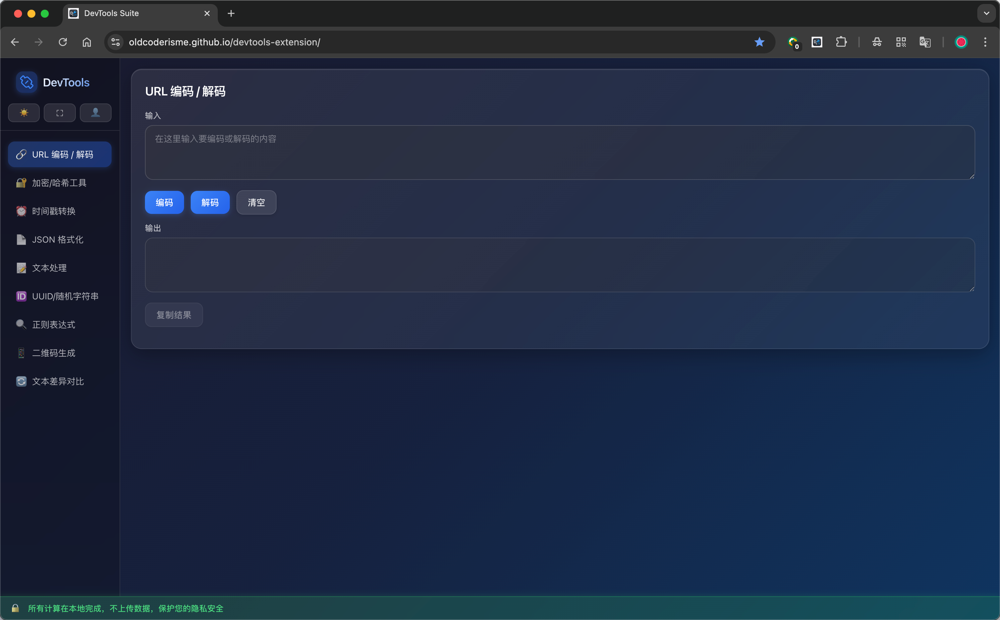
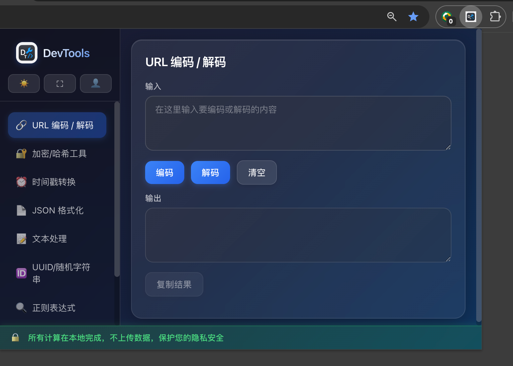
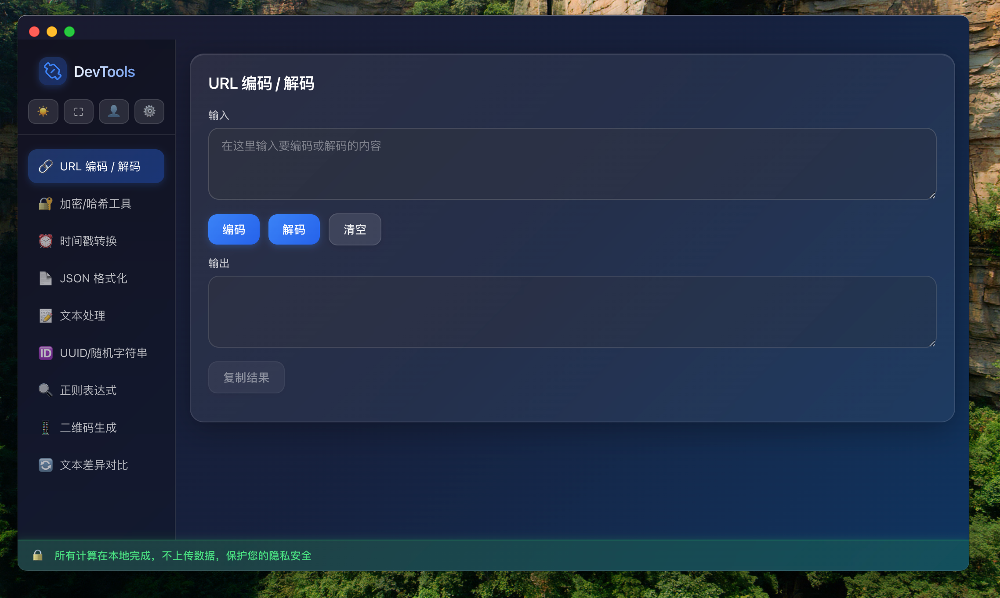
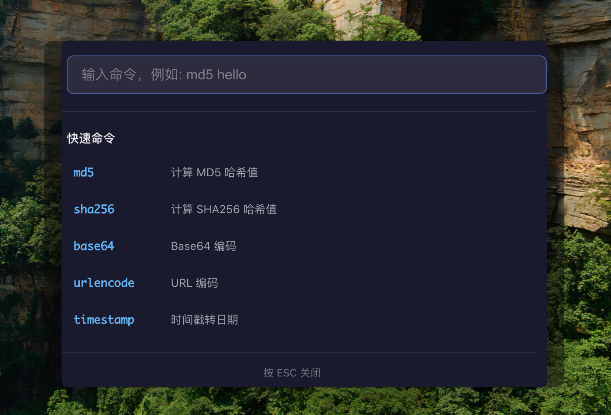

# DevTools Suite

一个功能丰富的开发工具集合，支持三种使用方式：Chrome 浏览器扩展、纯浏览器网页应用、macOS 桌面应用。所有计算都在本地完成，不会上传任何数据，保护您的隐私安全。

## 📸 截图预览

### 🌐 浏览器网页版


### 🔌 Chrome 浏览器扩展


### 🖥️ macOS 桌面客户端


### ⚡ 快速搜索弹窗


## 🌐 在线体验

**立即体验**：[https://oldcoderisme.github.io/devtools-extension/](https://oldcoderisme.github.io/devtools-extension/)

无需安装，直接在浏览器中使用所有功能。

## 📦 安装方式

### Chrome 浏览器扩展（推荐）

**Chrome 应用商店**：[安装 DevTools Suite](https://chromewebstore.google.com/detail/devtools-suite/fjebaljoclgdamiognofbdjplmbgkpil?authuser=0&hl=zh-CN)

一键安装，自动更新，集成到浏览器中，方便随时调用。

## 📦 三种使用方式

### 🌐 Chrome 浏览器扩展
作为 Chrome 扩展使用，集成到浏览器中，方便随时调用。

### 🌍 纯浏览器网页应用
部署为静态网站，直接在浏览器中访问使用，无需安装扩展。

**快速部署指南**：查看 [BROWSER_DEPLOY.md](./docs/BROWSER_DEPLOY.md)

### 🖥️ macOS 桌面应用（Electron）
使用 Electron 框架打包为原生 macOS 应用，独立运行，无需浏览器。

**快速开始 macOS 应用**：查看 [ELECTRON_QUICKSTART.md](./docs/ELECTRON_QUICKSTART.md)

## 功能列表

| 工具 | 功能描述 |
|------|---------|
| 🔗 **URL 编码/解码** | URL 编码和解码，支持批量处理 |
| 🔐 **加密/哈希工具** | Hash 算法（MD5、SHA1、SHA256、SHA512）、Base64 编码/解码、AES 加密/解密（AES128/AES256）、HMAC（MD5/SHA1/SHA256/SHA512），支持大小写切换 |
| ⏰ **时间戳转换** | 时间戳（秒/毫秒）↔ 本地时间，日期时间 → 时间戳（毫秒） |
| 📄 **JSON 格式化** | JSON 格式化（美化）、压缩、验证、转义/反转义 |
| 📝 **文本处理** | 文本去重（按行）、排序（升序/降序）、大小写转换（大写/小写/首字母大写/驼峰命名）、文本统计（字符数/单词数/行数/段落数） |
| 🔤 **Unicode 转换** | Unicode 编码与中文字符互转，支持 `\uXXXX` 和 `U+XXXX` 格式，支持批量转换 |
| 🆔 **密码/字符串/UUID生成** | UUID v4 生成、随机字符串生成（可配置字符集和长度）、随机密码生成（可配置字符类型），支持批量生成 |
| 📝 **Markdown 处理** | Markdown 编辑和实时预览、支持编辑/分屏/预览三种视图模式、支持下载为 .md 文件（点击下载弹出文件名输入对话框）、支持复制 Markdown 和 HTML 内容 |
| 🔍 **正则表达式测试** | 正则匹配测试，支持全局/忽略大小写/多行等标志，替换预览，显示匹配结果和分组 |
| 📱 **二维码生成器** | 文本/URL 转二维码，可配置尺寸（200-500px），支持下载二维码图片 |
| 🔄 **文本差异对比** | 按行/按字符对比，高亮显示新增/删除/未改变的内容，显示统计信息 |
| 📅 **年度倒计时** | 年度进度可视化，显示当前年份进度百分比、剩余天数，支持点阵进度展示（仅 macOS 桌面应用） |

## 技术栈

### Chrome 扩展
- **框架**：Vue 3 + TypeScript
- **构建工具**：Vite
- **加密库**：crypto-js
- **二维码**：qrcode

### macOS 桌面应用
- **框架**：Electron（行业最流行的桌面应用框架）
- **前端**：Vue 3 + TypeScript（复用扩展代码）
- **打包工具**：electron-builder
- **构建工具**：Vite

## 快速开始

### 方式一：在线使用（推荐）

直接访问 [在线体验地址](https://oldcoderisme.github.io/devtools-extension/)，无需安装即可使用所有功能。

### 方式二：Chrome 浏览器扩展

**推荐：从 Chrome 应用商店安装**
- 访问 [Chrome 应用商店](https://chromewebstore.google.com/detail/devtools-suite/fjebaljoclgdamiognofbdjplmbgkpil?authuser=0&hl=zh-CN)
- 点击"添加至 Chrome"即可安装
- 支持自动更新

**开发者模式安装（用于开发测试）**
1. **安装依赖并构建**
   ```bash
   npm install
   npm run build
   ```

2. **加载扩展**
   - 打开 Chrome 浏览器，访问 `chrome://extensions/`
   - 启用"开发者模式"
   - 点击"加载已解压的扩展程序"，选择 `dist` 文件夹

### 方式三：macOS 桌面应用

查看 [Electron 快速开始指南](./docs/ELECTRON_QUICKSTART.md)

### 本地开发

```bash
# 安装依赖
npm install

# 开发模式
npm run dev

# 构建
npm run build
```

## 项目结构

```
devtools-extension/
├── src/              # 源代码
│   ├── core/         # 核心功能函数
│   └── tools/        # 工具组件
├── scripts/          # 构建脚本
├── dist/             # 构建输出
├── docs/             # 文档
│   ├── BROWSER_DEPLOY.md           # 浏览器部署指南
│   ├── CHROME_EXTENSION_DEPLOY.md   # Chrome 扩展部署指南
│   ├── ELECTRON_QUICKSTART.md       # Electron 快速开始
│   ├── INSTALL.md                  # macOS 安装说明
│   └── ...
├── electron/         # Electron 配置
└── icons/            # 图标资源
```

## 注意事项

1. **隐私安全**：所有计算都在本地浏览器中完成，不会上传任何数据到服务器
2. **数据存储**：扩展使用 Chrome Storage API，数据仅存储在本地
3. **权限说明**：扩展只需要 `storage` 权限，用于本地数据存储

## 版本历史

### v0.1.2 - 客户端快捷指令版本 🚀

#### ✨ 新增功能

**快速搜索弹窗（类似 macOS Spotlight）**
- 🎯 全局快捷键支持（默认 `Cmd+K` / `Cmd+Space`，可自定义）
- ⚡ 快速命令执行：输入命令和参数即可显示结果
- 🔍 智能命令提示：输入时自动显示匹配的命令建议
- 🎨 模糊匹配：支持命令名、别名和描述的智能匹配
- ⌨️ 键盘导航：支持上下箭头、Tab、Enter 选择命令

**支持的命令**
- `md5` / `sha1` / `sha256` / `sha512` - 哈希计算
- `base64` / `b64` - Base64 编码
- `base64d` / `b64d` - Base64 解码
- `urlencode` / `url` / `ue` - URL 编码
- `urldecode` / `ud` - URL 解码
- `timestamp` / `ts` - 时间戳转日期
- `date` - 日期转时间戳

**快捷键自定义**
- ⚙️ 设置界面：支持自定义快速搜索快捷键
- 💾 设置持久化：快捷键配置自动保存
- 🔄 一键重置：支持恢复默认快捷键

**菜单栏图标（Tray Icon）**
- 📌 菜单栏常驻：应用图标显示在 macOS 菜单栏右侧
- 🖱️ 快速访问：点击图标显示/隐藏主窗口
- 📋 右键菜单：快速搜索、关于、退出等功能

#### 🐛 问题修复

- 修复 macOS 安装问题（DMG 拖拽安装）
- 修复退出功能不生效的问题
- 修复使用快捷弹窗后无法通过 Dock 图标打开主窗口的问题
- 优化窗口关闭行为（macOS 上关闭窗口隐藏到菜单栏）

#### 🎨 界面优化

- 更新应用图标（DevTools.icns）
- 优化快速搜索弹窗 UI
- 改进命令提示显示效果

#### 📝 文档更新

- 添加安装说明文档（[INSTALL.md](./docs/INSTALL.md)）
- 添加 macOS 菜单栏显示条件说明（[MENUBAR.md](./docs/MENUBAR.md)）
- 更新 Electron 快速开始指南（[ELECTRON_QUICKSTART.md](./docs/ELECTRON_QUICKSTART.md)）

### v0.1.1
- 添加 favicon 支持
- 修复 Vue 组件响应式警告
- 优化 README 文档结构
- 添加在线体验地址

### v0.1.3（当前版本）
- ✨ 新增 **Markdown 处理工具**
  - 支持 Markdown 编辑和实时预览
  - 三种视图模式：编辑、分屏、预览（可随时切换）
  - 支持下载为 .md 文件：点击下载按钮弹出文件名输入对话框，支持自定义文件名
  - 支持复制 Markdown 原始内容和 HTML 预览内容
  - 编辑区域支持清空和复制功能
  - 预览区域支持复制 HTML 功能
  - 下载按钮位于视图模式切换按钮右侧，方便快速访问
- 🔄 优化菜单名称：UUID/随机字符串 → 密码/字符串/UUID生成

### v0.1.1
- 添加 favicon 支持
- 修复 Vue 组件响应式警告
- 优化 README 文档结构
- 添加在线体验地址

### v0.1.0
- 初始版本
- 包含 9 个常用开发工具
- 支持 URL 编码、加密哈希、时间戳转换、JSON 格式化、文本处理、UUID 生成、正则测试、二维码生成、文本对比等功能

## 许可证

MIT License

## 贡献

欢迎提交 Issue 和 Pull Request！

